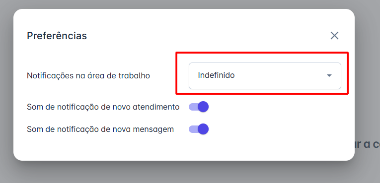
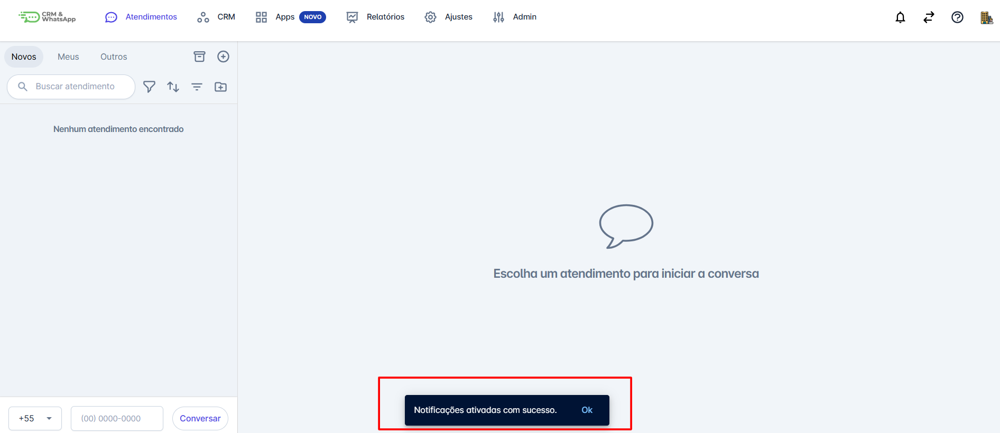

# Como Ativar as Notificações Web na Plataforma

Receber notificações em tempo real é essencial para manter a produtividade e não perder nenhuma interação importante com seus clientes. Pensando nisso, a **plataforma** permite que você ative notificações web diretamente na plataforma, garantindo alertas imediatos sempre que houver um novo atendimento, nova mensagem e/ou notificação de chat interno.

::: tip Pré-requisitos
* Se as notificações estão permitidas nas configurações do navegador.
* Se você já está logado na **plataforma**.
:::

## Como ativar as notificações web

### Passo 1: Ativar na interface

Acesse a **plataforma** e faça login com suas credenciais.
No canto superior esquerdo clique na opção de **"Ative as notificações na web"**.

### Passo 2: Confirmar permissão

A plataforma exibirá um pop-up para que você defina suas preferências. Para ativar os alertas, selecione a opção **'Habilitado'** em **'Notificações na área de trabalho'**.

### Passo 3: Notificações ativas

Pronto! Você começará a receber notificações sempre que houver novas interações, desde que a aba da **plataforma** esteja aberta.

## Considerações Finais

* Verifique se a aba da **plataforma** está aberta no navegador.
* Confirme se seu navegador permite notificações desse site.
* Tente desativar e ativar novamente nas configurações da plataforma.
